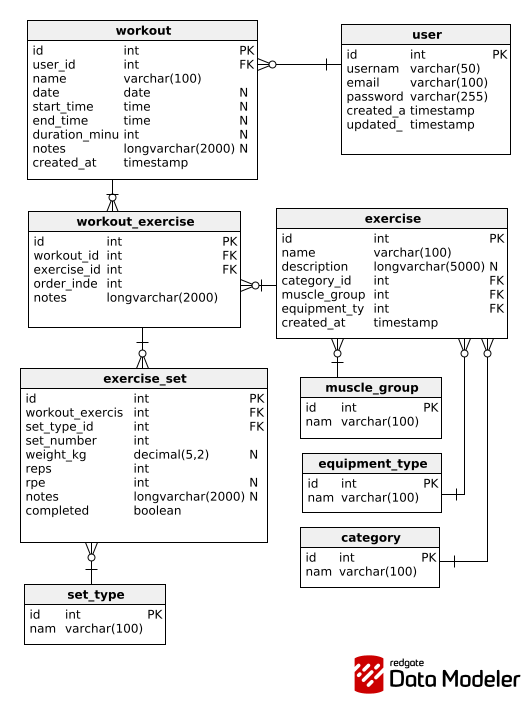

# Workout Tracker

A Spring Boot application for tracking strength training workouts, exercises, sets, and progress.

## Features

- **User Management**: Create and manage user profiles.
- **Workout Tracking**: Log workouts with date and comments.
- **Exercise Management**: Define exercises, categories, muscle groups, and equipment types.
- **Set Details**: Record specific sets within an exercise, including weight, repetitions, and set types (e.g., warm-up,
  working set).

## Getting Started

### Prerequisites

- Java 21 or higher
- Gradle (wrapper is included)

### Running the Application

1. Clone the repository.
2. Navigate to the project root.
3. Run the application using the Gradle wrapper:
   ```bash
   ./gradlew bootRun
   ```

The application will start on `http://localhost:8080`

## API Documentation

Once the application is running, you can access the Swagger UI to explore and test the API:

- **Swagger UI**: `http://localhost:8080/swagger-ui/index.html`

## Database

The project uses **HSQLDB**.

- By default, it runs in **in-memory** mode (`jdbc:hsqldb:hsql://localhost:9001/mydb` and `sa` as username).
- Schema and initial data are loaded from `src/main/resources/schema.sql` and `src/main/resources/data.sql`.
- Configuration can be found in `src/main/resources/application.properties`.

## ERD



